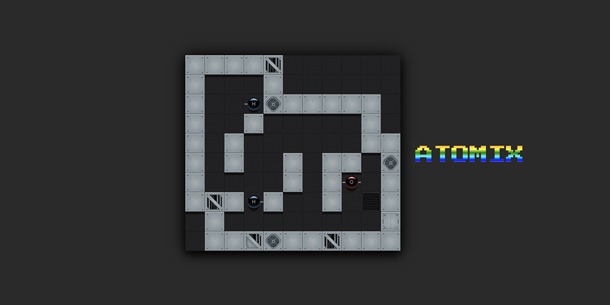

# ATOMIX

This project was a finger exercise to get acquainted with css transitions & animations and mobile touch events.

[PLAY ONLINE](https://andremichelle.github.io/atomix/)

## Credits
[level data](https://github.com/figlief/kp-atomix) | [tile graphics](https://marketplace.roll20.net/browse/set/1108/scifi-modular-tiles) | [gems graphics](https://graphicriver.net/item/gems-icons/19900411)

Based on [webware template](https://github.com/andremichelle/webware/)

# TODO
A nice ending screen for those who cracked all 30 puzzles.
